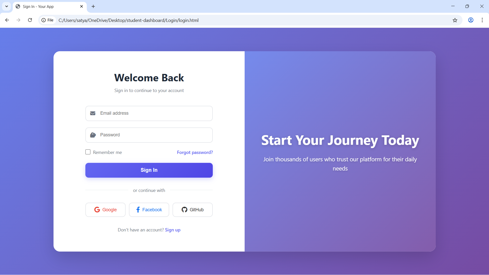
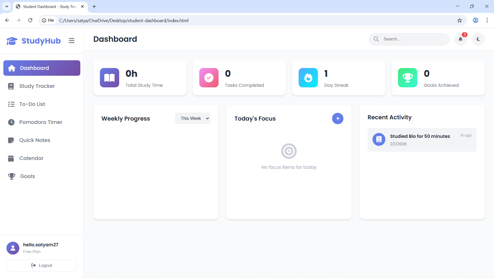

🎓 Student Study Tracker Dashboard

A web-based student productivity dashboard that helps manage study sessions, tasks, goals, and time using an interactive interface and client-side data management.

🚀 Features

🔐 Login & Signup system (simulated authentication)
👤 User-based data separation
✅ To-Do List with priorities
📝 Notes manager
🎯 Goal tracking
📅 Calendar & events
⏱️ Pomodoro timer
📊 Study session tracking
🌙 Dark/Light mode

🧠 Key Concept

This project demonstrates client-side multi-user state management.
Each user's data is stored separately using:
userEmail + "_dataType"
Example:
satyam@mail.com_todos
alex@mail.com_notes

🛠️ Tech Used

HTML
CSS
JavaScript
LocalStorage

⚙️ How to Run

Download the project
Open login.html in a browser
Sign up or log in
Start using the dashboard

⚠️ Note

This app uses localStorage only (no backend).
It is a frontend architecture demo project.

👨‍💻 Author

Satyam — Computer Science Student
